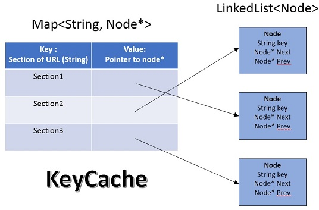
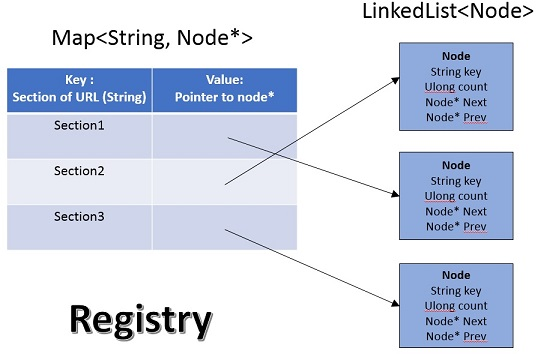

# Design document for the Solution #

### Problem Statement ###
Consume an actively written-to w3c-formatted HTTP access log and every 10s, display in the console the sections of the web site with the most hits, as well as interesting summary statistics on the traffic as a whole. The application has to run continuously on the console.

### Design ###
This problem deceptively looks simple but there are several tricky cases where one can run into. The simplest solution would be to have a hashmap that stores the sections of the website as key and frequency as value. The two problem with this solution is:
- The hashmap would keep getting bigger and ultimately blow up. There has to be a strategy to keep trimming the data.
- In a large dataset, you have to get a list of all the frequency of hits and then find the top K one. Typically, that would involve sorting the list. This operation had space complexity of O(n) and n*log(n) time complexity.

The design that has mitigates these issues with a mechanism to limit the size of hashmap store top N and can give the top K entries in with time complexity of O(K) and O(1) space complexity. This is due to two innovative data structures we are using here: KeyCache and Registry, both variants of LRU Cache:

  

KeyCache is a LRU Cache except it does not have a value part in the doubly linked list. So, the Hashmap of KeyCache contains website section (string) as a key and the value as pointer to a node as the value. The node in the linked list node contains Key again the link to previous and next node. There is a maximum limit on the size of the keys the cache is storing (which will also be the maximum length of the linked list and the maximum size of hashmap). This KeyCache has only 1 public method which is KeyOut:string Put(KeyIn:string). On every invocation, user supplies a new key to the function. If the key is already present in the list, it will be remove the key from the list and placed it on top in the head of the list. Since there is a hashmap is storing all the values, it is possible to reach the key node in O(1) time. If the key is not present, it will create a new key and put it in the head. In case it added the new key and the size of the hashmap exceeds the max limit, it removes the least used key from the tail of the list as well as map map and returns it. If no key is removed, the function returns null. The entire operation take O(1) space and time.

  

Similar to Key, we have the second structure called Registry. It uses the same data structure as LRU cache. The node of the doubly linked list contains the section name (the key), frequency count (unsigned long integer), and the previous & next pointer. The hashmap of Registry contains website section (string) as a key and the value as pointer to a node as the value. It supports three operations:
- void Increment(string section): Given a section, it increments the count by one if the section exists or creates a section in the hashmap & linked list with count 1. Given we are using Hashmap here, retrieving the section takes O(1) time. We are using unsigned long integer to store, so if there is an overflow, we decrease all the counts by a fixed number (in this case 3). Since we are interested in overall profile of section counts, absolute count would not matter and decreasing by small amount will not make any difference in overall profile. If a section is created, the count is initialized to 1 and places at the tail of the doubly linked list and there is an entry to hashmap pointed out to it. When the count is incremented, the systems checks if the previous node (in the direction of head) has lower count or not. If yes, then it moves the current node up. It repeats this process until this condition is no longer true. This ensure that the linked list is always sorted, with the largest count at head and smallest count at the tail.
- void Remove(string section): Remove would simply remove the key entry from both the Hashmap and the LinkedList. This is needed the KeyCache eliminates a key when it reaches the capacity.
- void PrintStats(int n): Function to print the top n keys. Since the linked list is sorted, it just has to print the top n keys or all the keys if the total size of the list is less than n.

The main function is in the Program.cs file. This file contains three parameters that the user needs to define:
- int MaxSize: Maximum size of the Map where URL sections are stored, set as 10000 default value
- int Threshold: Threshold for declaring High/Low traffic, set as 1000 default value
- int DisplaySize: Maximum number of entries to be displayed, set as 10 default value
- TimeSpan TimeWindow: Timespan for flipping between High & Low traffic, set as 2 minutes default value

The code in the main function is fairly straightforward, so I will not bother explaining it here. For the DEBUG build, the program will simply open the test.txt file and execute traffic log defined in the code. For the release build, the code would accept input log from the standard input and keep running until it reaches the eof, which is when it readline receives a null value.

The critical logic resides in Traffic class. This class holds registry, key cache and queue which holds the timestamps received within TimeWindow period (set as 2 mins). The constructor for this class initializes the Registry, Key Cache and sets the traffic status to low traffic. This class had 7 methods but we will explain 2, the remaining 5 are self-explanatory:
- void Update(url Url, timestamp Timestamp): This will update the Url in the registry if it is valid. Next it passes the section of the incoming Url to KeyCache. If KeyCache returns a key that it removed, that key is subsequently removed from Registry also. Finally, if the timestamp is valid, it will enter the time stamp in the traffic queue.
- int Check(timestamp Timestamp, TimeSpan TimeWindow): If Time stamp is valid then it removes all the entries from the queue which are outside the TimeWindow period (2 mins).

### Compiling &amp; Executing ###
You need to have .Net platform or Mono Framework installed to run locally. They program can be built in Debug and Release mode. There is a file called test.txt which contains a sample log.

To compile the code in debug mode, run the command:
> msbuild Solution.sln /p:Configuration=Debug

This will generate the folder Debug which contains the Solution.exe and the sample log test.txt. Just execute the file Solution.exe and it will open the file test.txt and read the logs from it.

To compile the code in release in debug mode, run the command:
> msbuild Solution.sln /p:Configuration=Release

This will generate the folder Release which contains the Solution.exe and the sample log test.txt. Just execute the file Solution.exe. It will read the input from standard command line. If it is required to read from the test file or any other file, the input can be redirected from the file.

